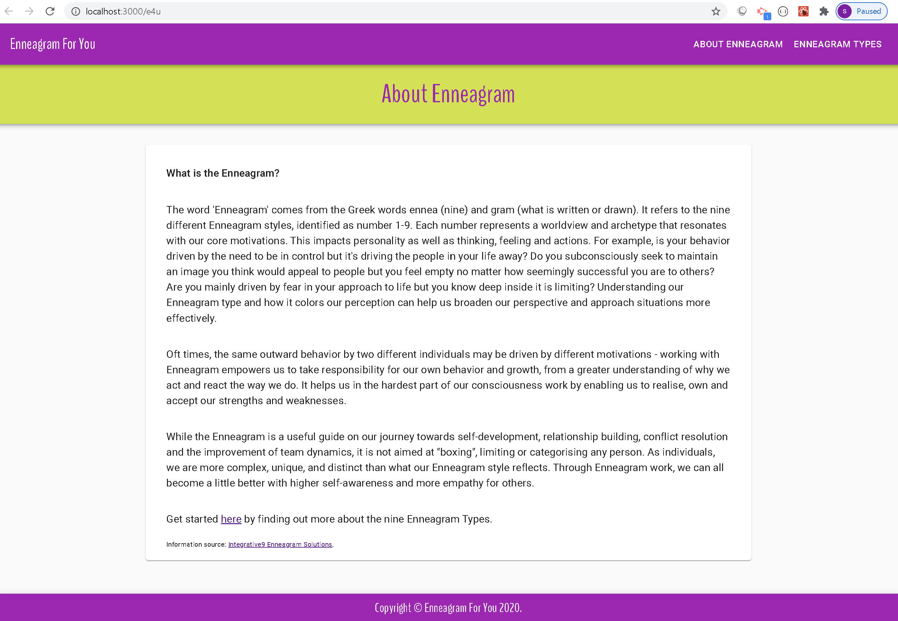
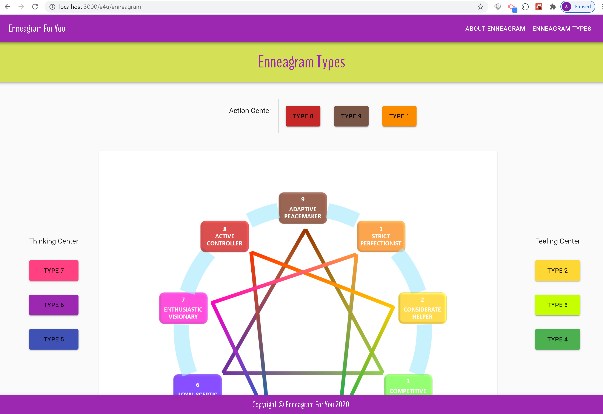

# e4u
An enneagram web app for you to utilise enneagram to understand more about yourself

+ Github link: https://github.com/sevenspell/e4u/

+ Deployed Github Page: https://sevenspell.github.io/e4u/

## Description 

This is a React App built using Material UI. In the first stage, this app focuses on providing background information on Enneagram and the different types it encompasses.

Currently, this front-end client-side only application is built using React, React Components, Hooks and JSX amongst other React functionalities.

In the next stage where more functionalities are offered such as user account signup, login, and enneagram testing, back-end server and databases will be utilised.

## Technology Used
+ React
+ Material UI

## Usage 

1. Go to deployed Github app link: https://sevenspell.github.io/e4u/

2. Click on 'Enneagram Types' in the Nav Bar to proceed to the next page.

## Credits
